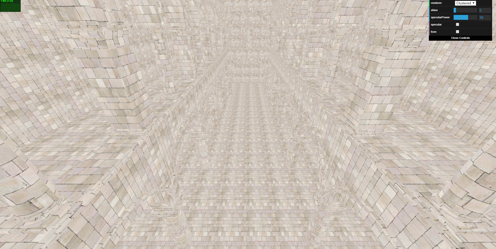
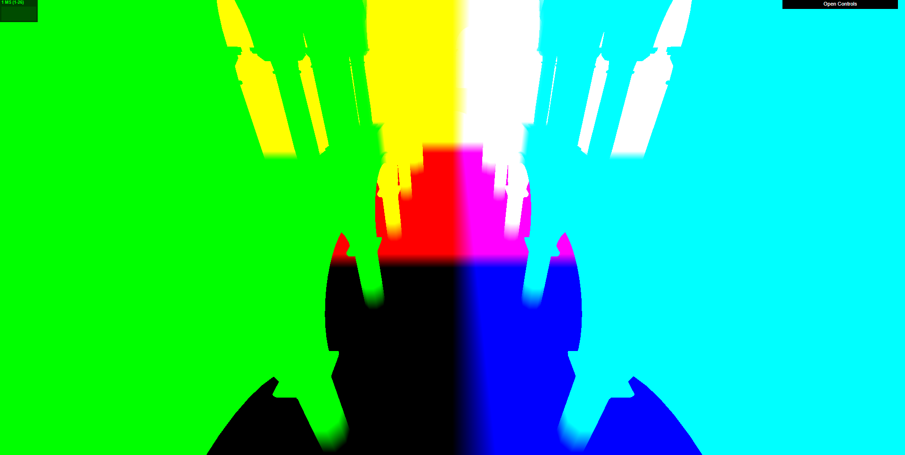
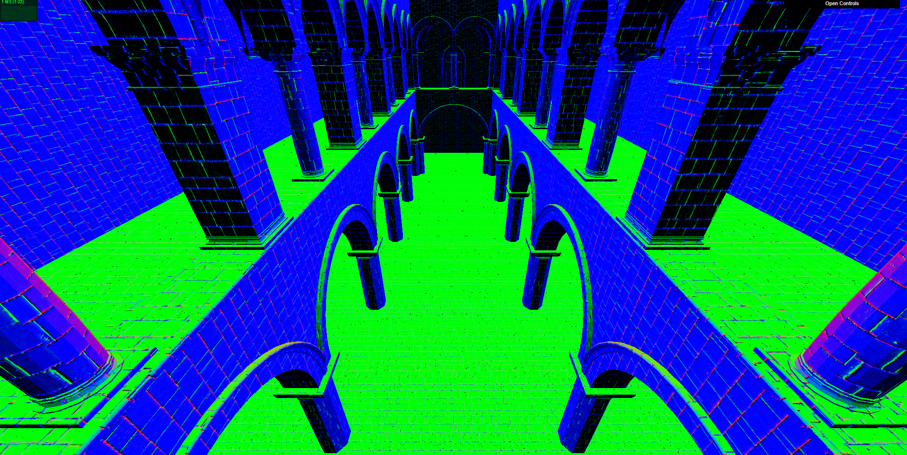
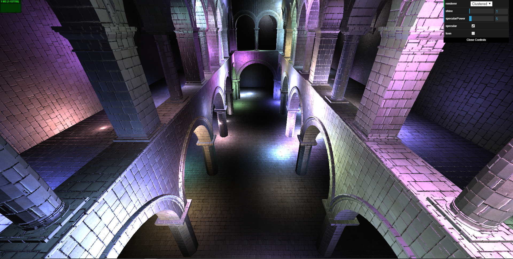
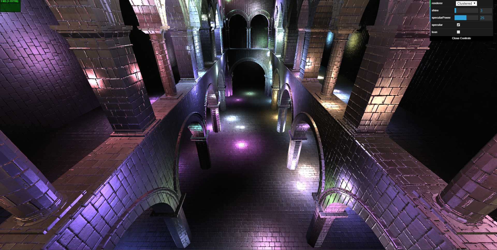
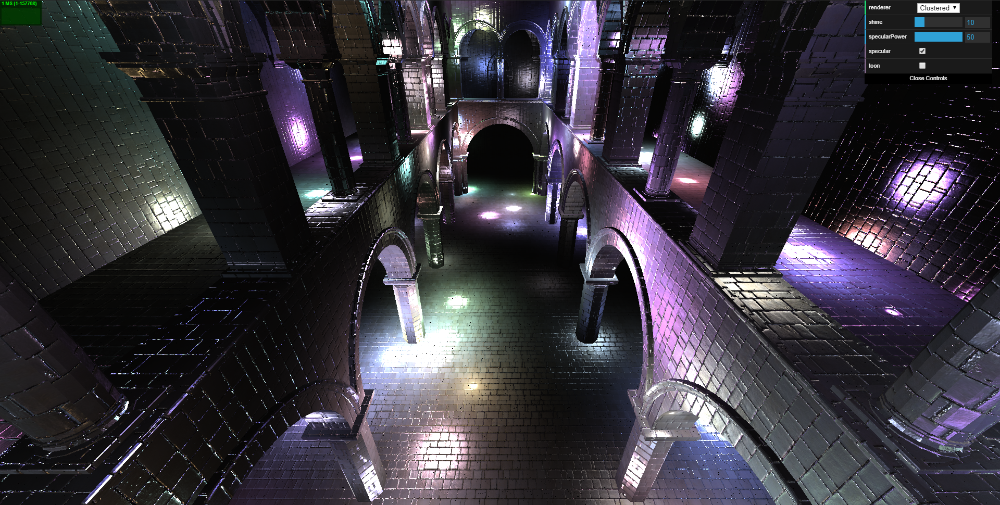
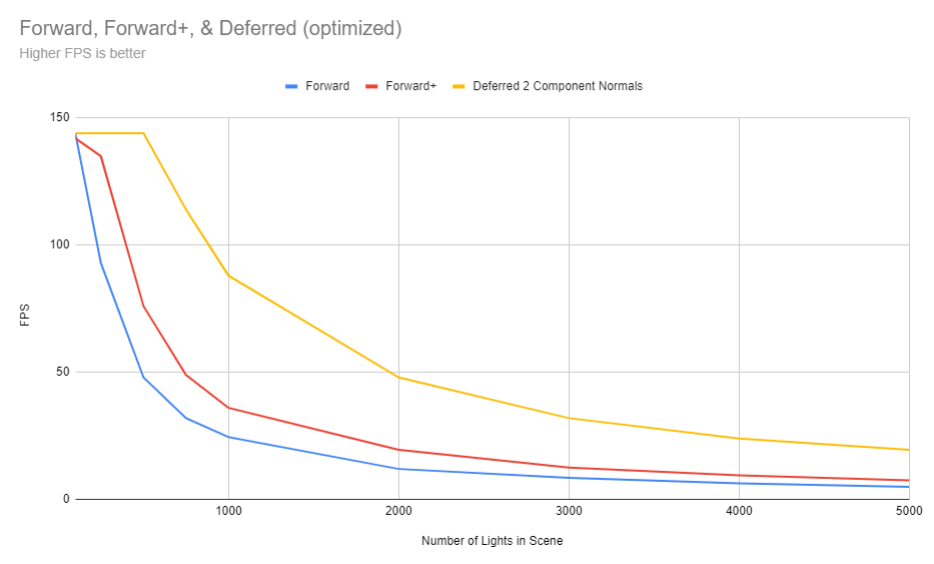
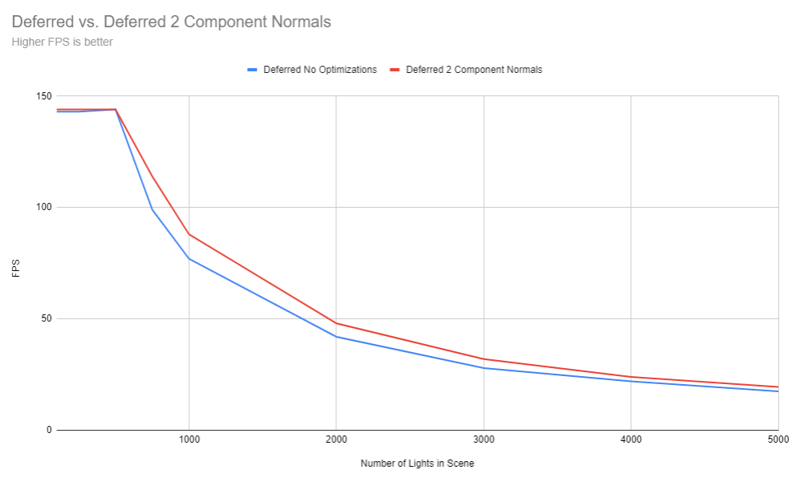
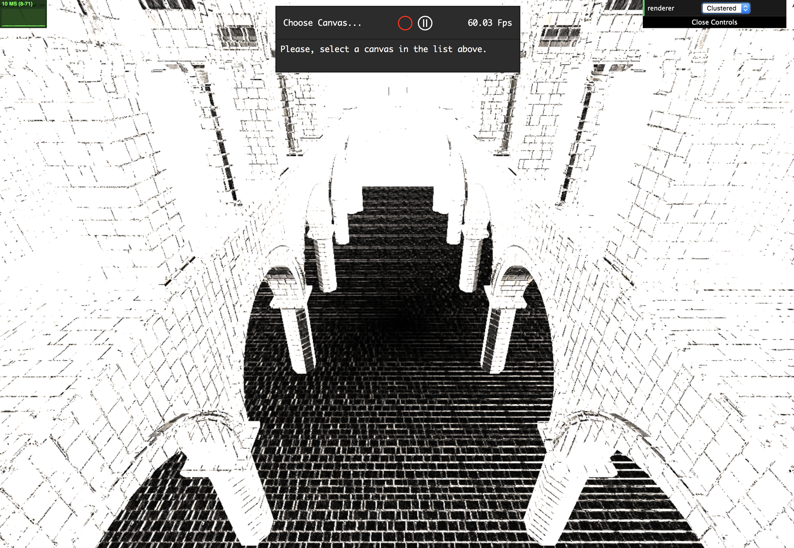

WebGL Clustered and Forward+ Shading
======================

**University of Pennsylvania, CIS 565: GPU Programming and Architecture, Project 5**

* Grace Gilbert
  * https://www.linkedin.com/in/grace-gilbert-2493a0156, http://gracelgilbert.com
* Tested on: Windows 10, i9-9900K @ 3.60GHz 64GB, GeForce RTX 2080 40860MB

<p align="center">
  
</p>

### Live Demo
[](https://gracelgilbert.github.io/Project6-WebGL-Clustered-Deferred-Forward-Plus)

Note that the thumbnail gif is reduced quality due to its length. Click on the image to run the demo for the full quality.

# Overview
In this project, I implemented a Forward+ and clustered deferred renderer with additional effects and optimizations. A forward renderer iterates inefficientyly over every light for every point in the scene. A Forward+ renderer divides the scene into clusters and determines which lights affect each cluster. Therefore, when rendering, we only need to perform light calculations on the lights that affect the current cluster. A deferred renderer performs an initial pass that stores scene information in textures, which are used in a second pass for lighting calculations. This process decouples scene complexity from lighting, enabling efficient rendering of complex scenes with many lights. Clustering also applies here, as we can avoid sampling all the lights and just focus on ones in the relevant clusters. For the clustered deferred renderer, I added specularity and tested various optimizations. 

100 Lights           |  200 Lights               | 400 Lights
:-------------------------:|:-------------------------:|:-------------------------:
|  |

# Credits
* [Three.js](https://github.com/mrdoob/three.js) by [@mrdoob](https://github.com/mrdoob) and contributors
* [stats.js](https://github.com/mrdoob/stats.js) by [@mrdoob](https://github.com/mrdoob) and contributors
* [webgl-debug](https://github.com/KhronosGroup/WebGLDeveloperTools) by Khronos Group Inc.
* [glMatrix](https://github.com/toji/gl-matrix) by [@toji](https://github.com/toji) and contributors
* [minimal-gltf-loader](https://github.com/shrekshao/minimal-gltf-loader) by [@shrekshao](https://github.com/shrekshao)

# Implementation
## Clustering
The first step of clustering is to fill the clusters with the lights that influence that space. I performed clustering in view space, meaning I transformed the world position of the lights into view space and divided the viewing frustum into clusters. To find the appropriate clusters, I need to find the range of effected clusters in the x, y, and z dimension. For the z dimension, the depth of the frustum is the difference between the near and far clip plane. The depth of each cluster is therefore this difference divided by the number of slices in the z dimension. To convert the min and max bounds of the z influence of the light into unit grid space, which each cluster is depth 1, I perform the following calculation:
```
minZGridIndex = floor((viewSpace.z - lightRadius - cameraNearPlace) / clusterDepth)
maxZGridIndex = ceil((viewSpace.z + lightRadius - cameraNearPlace) / clusterDepth)
```
I then make sure that the lights are not completely outside the frustum, and the clamp the bounds to 0 and the number of slices in the z direction.

The calculation for the x and y bounds for the clusters is a different process. For these bounds, I essentially sweep over the clusters until finding a cluster that overalaps with the sphere of influence on the lower bound, and then find the upper bound by continuing to sweep across until the cluster no longer overlaps the sphere of influence. This process applies to both the x and y directions. 

We start our sweep at cluster 0 and continue to the number of slices, breaking if we reach an overlap with the light influence. To do this, we find the direction from the camera along the angle of our currrent slice we are sweeping over. We project this direction onto the direction from the camera to the light, and if the distance of this projection is shorter than the radius of the light, we know that the cluster is within the light's sphere of influence, meaning we have found our minimum bound cluster. When finding the maximum bound, if the distance to the light is larger than the radius, we know we have just exited the sphere of influence, giving us the maximum cluster bound.

One we know the cluster index bounds in all dimensions, we perform a triple for loop from the min to the max in each dimension, adding the light to all clusters within its sphere of influence.

The final step in clustering is accessing the correct lights per cluster from the shader. For this, we have to find the cluster that the point we are currently shading belongs in. To get the x and y cluster index, we can find the fragment position in 0-1 space and scale it up by the number of slices in the x and y direction, flooring this value to get an integral index. For the z cluster index, we convert the world position of the fragment into view space by passing in the view matrix of the camera. We then perform the same operations on the z coordinate as we did when creating the clusters:
```
zGridIndex = int((viewSpacePosition.z - camera.nearPlane) * numZSlices / (camera.far - camera.near))
```
Once we know what cluster we are in, we can access the number of lights in the cluster, which is stored in the first component of that cluster's column in the texture. We then iterate over that many lights, getting the index of each light and unpacking that light from the light texture, rather than simply iterating over every light stored in the light texture.

## Forward+
Forward+ shading is very similar to forward shading, except rather than iterating over every light in the scene for every fragment, we take advantage of the clustering. Using the process described above, we add each light to all the clusters within their sphere of influence. Then when shading a fragment, we determine what cluster it is in and only perform light calculations on the lights that affect that cluster.

## Deferred
Deferred rendering is done in two passes. The first pass takes in the world position, normals, and uvs. It calculates the albedo and normal from texture and normal maps and stores these values, along with the world position, into a texture. The simplest way of doing this is by having one texture for position, where x, y, and z are the position values, another texture for normals, where x, y and z are normal values, and a third texture for color data, again with x, y, and z being RGB. 

In a second pass, we use our uv values to read in from the textures generated in the first pass. We now have access to our position, normals, and albedo. In this pass, we also read from our light buffer, which stores the light position, radius, and color data. This provides enough information about the geometry and the lights to perform lighting and shading calculations on the scene, creating a complete image.

Albedo           |  Position        | Normal
:-------------------------:|:-------------------------:|:-------------------------:
|  |

### With Clustering
Clustering can also be applied to deferred shading. To perform the lighting calculations on the scene, the naive solution is to iterate over all of the lights in the scene and perform shading with the fragment based on the data passed in through the textures. However, we can apply the same process as in forward+ shading and find the cluster of the fragment being shaded. We can pass in the same cluster buffer generated before, and access all of the lights that affect the cluster of our fragment, reducing the number of lighting calculations we must perform in the deferred shader.

### Specular Lighting


Specular lighting involves adding highlights to the geometry in areas that are more strongly hit by the light sources. To do this, we can generate a specular reflective term using the normal of the geometry and the direction from the fragment to the light source:
```
reflectiveTerm = pow(abs(dot(normal, directionToLight)), specularIntensity)
```
For my specular reflections, I set initial specular intensity to 30, which gives noticable shine and highlights, but ones that are still fairly smooth and not too harsh. The user can adjust the intensity to their liking. I also added the ability for the user to scale the influence of the specular term. This term is then added to the lambertian term in the final color calculation:
```
fragmentColor += albedo * (lambertTerm _ reflectiveTerm) * lightColor * lightIntensity
```
Below are examples with varying specular powers and scales:

Scale 1 Power 5           |  Scale 3 Power 25        | Scale 10 Power 50
:-------------------------:|:-------------------------:|:-------------------------:
|  |

### Toon Shading


Toon shading has two elements: ramp shading and outlines. For ramp shading, I calculate the luminance of the output color using the following equation:
```
luminance = 0.2126 * R + 0.7152 * G + 0.0722 * B
```

I then group the luminance into discrete levels. If above 0.95, the color remains its original color. If above 0.4, the color is scaled by 0.8. If above 0.25, the color is scaled by 0.5. I continue this for 5 steps. 

To get the outlines, I first get the depth of the surrounding 8 pixels by accessing the position texture at the surrounding pixels. I take the horizontal and vertical gradient of the surrounding 8 pixels and perform a length calculation on them:
```
scale = sqrt(horizontal^2 + vertical^2)
```
If this scale value is high, that means there is a significant change in depth, meaning there is an edge at that position. To create the outline, if the scale value is above 0.9, I change the output color to the outline color, which in this case, is purple.

Note that the user can choose to turn on and off specular lighting and toon shading.

### Optimizations
#### 2 Component Normals and Packed Values into Vec4s
Each pixel in a texture can hold 4 values, R, G, B, and Alpha. In the above description, we only use the R, G, and B channels of each of the three textures. To optimize, we can pack our vec4s by using the alpha channel. We have 9 values to pass through to the texture, so even if we did pack all 4 channels, we would still need 3 textures, and the fourth would only utilize one of its channels, not improving efficiency. However, we can also cut out one of the components of the normal data. Because normals are normalized, we know that their length is 1. Therefore, if we have 2 of the 3 components of the normal, we can calculate the third by figuring out what value would make its length 1.

In the optimized packing of our textures, I only use two textures. In the first, the RGB values contain the position data. The alpha contains the x value of the normal. In the second texture, RGB contains the albedo value and the alpha contains the y value of the normal. In the second pass of deferred rendering, I calculate the z value of the normal using the following equation:
```
normalZ = sqrt(1 - normalX^2 - normalY^2)
```
Performance analysis of this optimization can be found below in the section on performance analysis.

# Performance Analysis
## Forward, Forward+, Deferred
The following chart demonstrates the relative performances of the three renderers with a varying number of lights in the scene:



The data indicates that the deferred renderer is indeed the fastes of the three, and the forward+ is faster than regular forward rendering. The reason for the plateau at the top for the deferred renderer is that the maximum FPS is 144, and it reaches that up until about 750 lights. All three renderers follow a similar exponential decrease in performance as the lights increase. While the forward renderer is the only one that must go through all of the lights, as the total number of lights increase, the total number of lights per cluster increases at a similar rate. Therefore, while always faster than forward, forward+ and deferred are still similarly impacted by more lights.

## Deferred Optimizations
The following chart compares the performance of deferred rendering with and without the vec4 packing and 2 component normals optimization:



The comparison shows that the optimization did improve the FPS of the deferred renderer, but not very significantly. This indicates that the slowdown of having the additional texture being passed does slow down the renderer, but is not extremeley significant relative to the overall benefit gained from deferred rendering.

# Bloopers
When testing the output of my deferred texture passes, I accidentally combined texture components in a way that created an interesting black and white cartoon effect.


